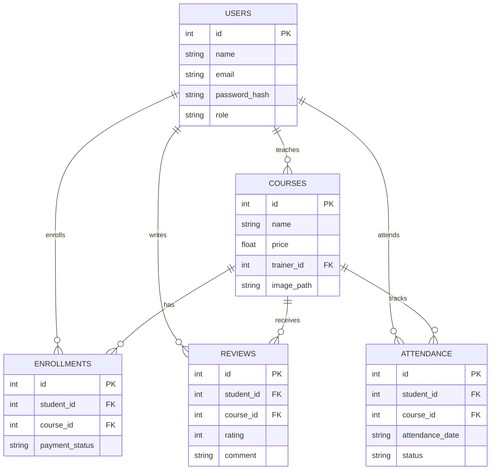

<div align="center">

# Course Management System

**A desktop application for managing training courses, trainers, students, enrollments and attendance.**


</div>

---

## Overview

Course Management System is a role-based JavaFX desktop app built as a team project for an Object-Oriented Programming course. It covers the full lifecycle of a training center: admins publish courses and assign trainers; students browse, enroll, pay and review courses; and trainers track their students and take daily attendance. All data is stored locally in an embedded SQLite database that is created automatically on first run.

## Features

### Authentication
- Sign up and log in with three roles: **Admin**, **Trainer** and **Student**
- Passwords hashed with **BCrypt**, plus email and password-strength validation
- Guest mode to browse the course catalog without an account

### Admin
- Dashboard with live statistics (students, trainers, courses, enrollments)
- Create, edit and delete courses with price, description, cover image and assigned trainer
- Searchable course table with filtering by trainer

### Student
- Browse the catalog with search, enrollment counts and average ratings
- Enroll in courses and track payment status (paid / unpaid)
- Rate and review enrolled courses (1–5 stars with comments)

### Trainer
- Dashboard with assigned courses and student counts
- View all students enrolled in their courses
- Daily attendance sheet per course: mark present / absent, mark all, search and save

## Tech Stack

| Layer | Technology |
|---|---|
| Language | Java 25 |
| UI | JavaFX 25 (FXML + CSS) |
| Database | SQLite (SQLite JDBC) |
| Security | jBCrypt password hashing |
| Build | Maven (wrapper included) |

## Database Schema



## Project Structure

```
src/main/java/org/example/finaloop
├── model        # ParentUsers (abstract), Admin, Trainer, Student, Course, Enrollment, Review, Attendance
├── database     # DBconnection, DataBaseStart (schema + queries)
├── service      # Authentication, Session, ImageStore
├── ui           # Navigator, Ui helpers, CourseCover
└── controller   # One controller per screen
src/main/resources/org/example/finaloop
├── view         # FXML screens
└── styles       # theme.css
```

**OOP concepts applied:** inheritance (`ParentUsers` → `Admin` / `Trainer` / `Student`), abstraction (abstract `getHomePage()` for role-based navigation), encapsulation and polymorphism.

## Getting Started

### Prerequisites
- JDK 25
- IntelliJ IDEA (recommended)

JavaFX, SQLite JDBC and jBCrypt are downloaded automatically by Maven.

### Run in IntelliJ
1. **File → Open** and select the project folder.
2. Wait for Maven to finish loading; choose **JDK 25** if prompted.
3. Run the **`Launcher`** configuration.

### Run from the terminal
```bash
# Windows
mvnw.cmd javafx:run

# macOS / Linux
./mvnw javafx:run
```

The database file `app.db` is created automatically in the project folder on first launch.

### Quick walkthrough
1. Sign up a **trainer** account and an **admin** account.
2. Log in as the admin and add courses (each course needs a trainer).
3. Sign up a **student** to browse, enroll, pay and leave reviews.
4. Log in as the trainer to view students and take attendance.

## Documentation

The full project report is available in [`docs/Report.pdf`](docs/Report.pdf).

## Team

| Member | GitHub | Responsibilities |
|---|---|---|
| **Ramez Medhat** | [@mrramez](https://github.com/mrramez) | Trainer & Attendance: attendance table and JOIN queries, Trainer / Attendance models, Trainer Dashboard, My Students and Attendance screens |
| **Mohanad Hajeb** | [@MohanadSec](https://github.com/MohanadSec) | Admin & Courses: courses table, Admin / Course models, Admin Dashboard, Add Course and View Courses screens |
| **Ahmed Al-Hammadi** | [@Ahmedcrp](https://github.com/Ahmedcrp) | Student & Enrollment: enrollments and reviews tables, Student / Enrollment / Review models, Browse Courses, My Courses and Review screens |
| **Abdulrahman Al-Baadani** | — | Authentication & Core: users table, DBconnection, ParentUsers, Authentication, Welcome / Login / Sign-up screens |

---

<div align="center">
Built with Java and JavaFX
</div>
